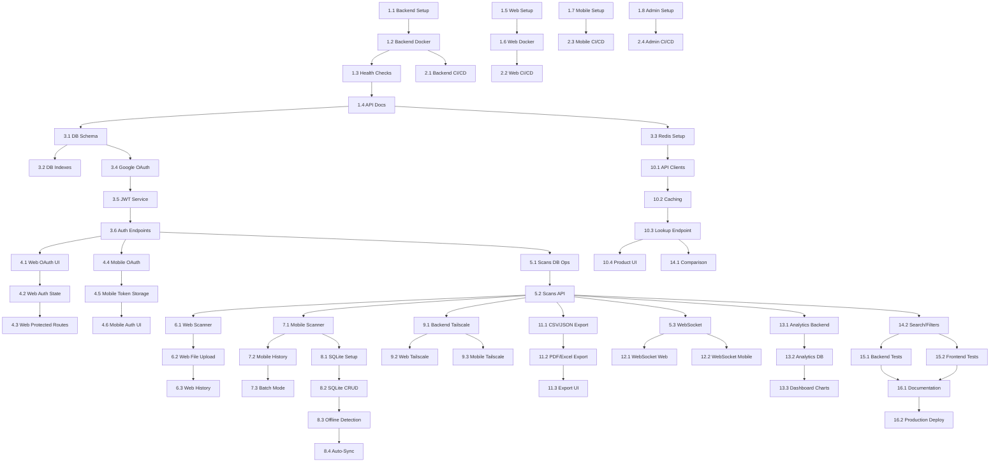

# Barcody - Modular Implementation Task List

> **Strategy**: Atomic tasks optimized for AI agent single-shot implementation
>
> **Structure**: 65 focused tasks, 5-8 checkboxes each, single responsibility
>
> **Goal**: Seamless, robust, bug-free implementation

---

## Phase 1: Foundation (Tasks 1-8)

### Task 1.1: Backend Project Setup

**Scope**: Initialize NestJS backend with core configuration

- [ ] Initialize NestJS project: `nest new backend`
- [ ] Configure `tsconfig.json` with strict mode and path aliases (`@/modules`, `@/common`, `@/config`)
- [ ] Create directory structure:
  - `src/common/` (decorators, filters, guards, interceptors, pipes)
  - `src/shared/services/` and `src/shared/utils/`
  - `src/database/migrations/` and `src/database/seeds/`
- [ ] Set up `.env.example`, `.env.development`, `.env.production`, `.env.test`
- [ ] Install core dependencies: `@nestjs/config`, `class-validator`, `class-transformer`, `winston`
- [ ] Create environment validation schema with all 11 required variables
- [ ] Configure Winston logger with log levels, JSON format, timestamps
- [ ] Configure API versioning: global prefix `/api/v1`
- [ ] Create logging interceptor in `common/interceptors/`
- [ ] Create HTTP exception filter in `common/filters/`
- [ ] Add validation on app bootstrap
- [ ] Test: `npm run start:dev` works
- [ ] Test: App fails with missing env vars
- [ ] Test: All endpoints accessible at `/api/v1/*`

**Acceptance**: Backend starts without errors, logger outputs JSON

---

### Task 1.2: Backend Docker Setup

**Scope**: Containerize backend with multi-stage build

- [ ] Create `Dockerfile` with optimized multi-stage build:
  - Use alpine base images
  - Builder stage + runner stage
  - Copy only production dependencies
  - Remove dev dependencies in final image
- [ ] Create comprehensive `.dockerignore` file
- [ ] Create `docker-compose.yml` with PostgreSQL, Redis, backend services
- [ ] Add named volumes for PostgreSQL data persistence
- [ ] Add named volumes for Redis data persistence
- [ ] Add health check to Dockerfile
- [ ] Configure environment variables in docker-compose
- [ ] Test: `docker-compose up -d` starts all services
- [ ] Test: Backend accessible at `localhost:8000`
- [ ] Test: Data persists after container restart
- [ ] Test: Production image size <200MB

**Acceptance**: All containers start, backend responds to requests

---

### Task 1.3: Backend Health Checks

**Scope**: Implement comprehensive health monitoring

- [ ] Install `@nestjs/terminus`
- [ ] Create `HealthModule`
- [ ] Implement `/health` endpoint (overall health)
- [ ] Implement `/health/db` endpoint (PostgreSQL check)
- [ ] Implement `/health/redis` endpoint (Redis check)
- [ ] Add health check to Docker Compose
- [ ] Test: All health endpoints return 200 OK

**Acceptance**: Health checks pass, Docker health status shows healthy

---

### Task 1.4: Backend API Documentation

**Scope**: Set up Swagger/OpenAPI documentation

- [ ] Install `@nestjs/swagger`
- [ ] Configure Swagger in `main.ts`
- [ ] Add API metadata (title, description, version)
- [ ] Create example DTO with decorators
- [ ] Test: Swagger UI accessible at `/api/docs`
- [ ] Verify: API documentation renders correctly

**Acceptance**: Swagger UI loads, shows API documentation

---

### Task 1.5: Web Project Setup

**Scope**: Initialize Next.js web application

- [ ] Initialize Next.js 14+: `npx create-next-app@latest web --typescript --tailwind --app`
- [ ] Configure `tsconfig.json` with path aliases (`@/components`, `@/lib`, `@/app`)
- [ ] Set up `.env.local.example`
- [ ] Install shadcn/ui: `npx shadcn-ui@latest init`
- [ ] Install shadcn/ui components: button, input, card, dialog, dropdown-menu, table, tabs, toast, select, checkbox, skeleton, badge, alert, separator
- [ ] Configure dark mode (default)
- [ ] Create basic layout with header
- [ ] Create `app/api/health/route.ts` (health check endpoint)
- [ ] Test: `npm run dev` works at `localhost:3000`
- [ ] Test: shadcn components render correctly

**Acceptance**: Web app loads with dark mode, Tailwind working

---

### Task 1.6: Web Docker Setup

**Scope**: Containerize web application

- [ ] Create `Dockerfile` with multi-stage build
- [ ] Create `.dockerignore`
- [ ] Add web service to `docker-compose.yml`
- [ ] Configure environment variables
- [ ] Test: `docker-compose up web` works
- [ ] Test: Web accessible at `localhost:3000`

**Acceptance**: Web container runs, app accessible

---

### Task 1.7: Mobile Project Setup

**Scope**: Initialize Expo mobile application

- [ ] Initialize Expo: `npx create-expo-app@latest mobile --template blank-typescript`
- [ ] Configure `app.json` (name: "Barcody", slug, version)
- [ ] Set up `eas.json` with build profiles (production, preview, development)
- [ ] Configure dark theme in `app.json`
- [ ] Design app icon (1024x1024px, neon blue theme) and generate all sizes
- [ ] Design splash screen (dark mode, neon blue) and configure in app.json
- [ ] Install navigation: `expo-router`
- [ ] Install optimization packages: `expo-image`
- [ ] Configure WebP format for all images
- [ ] Compress app icon and splash screen
- [ ] Create app/(tabs)/\_layout.tsx with tab configuration
- [ ] Configure tabs: Scan, History, Settings with icons
- [ ] Create placeholder screens for each tab with lazy loading
- [ ] Implement dynamic imports for heavy components
- [ ] Test: `npx expo start` works
- [ ] Test: Tab navigation works
- [ ] Test: Custom icon and splash screen show
- [ ] Test: Images load quickly

**Acceptance**: Mobile app runs in Expo Go, dark theme applied

---

### Task 1.8: Admin Dashboard Setup

**Scope**: Initialize admin dashboard

- [ ] Initialize Next.js: `npx create-next-app@latest admin --typescript --tailwind --app`
- [ ] Install Supabase client: `@supabase/supabase-js`
- [ ] Configure Supabase connection
- [ ] Create basic dashboard layout
- [ ] Set up Vercel deployment configuration (`vercel.json`)
- [ ] Test: Dashboard loads locally
- [ ] Test: Supabase connection works

**Acceptance**: Admin dashboard runs, connects to Supabase

---

### Task 1.9: Admin Dashboard Authentication

**Scope**: Implement Gmail OAuth for admin access

- [ ] Configure Gmail OAuth in Supabase Auth
- [ ] Create login page with Gmail sign-in button
- [ ] Implement OAuth callback handler
- [ ] Create auth context provider
- [ ] Create protected route wrapper component
- [ ] Restrict access to single admin email (from environment variable)
- [ ] Add logout functionality
- [ ] Test: Only admin email can access dashboard
- [ ] Test: Unauthorized users redirected to login

**Acceptance**: Admin dashboard secured, only authorized admin can access

---

## Phase 2: CI/CD Pipeline (Tasks 9-12)

### Task 2.1: Backend CI/CD

**Scope**: Automate backend Docker builds

- [ ] Create `.github/workflows/backend-build.yml`
- [ ] Configure Docker Buildx
- [ ] Add Docker Hub login step
- [ ] Implement multi-platform build (linux/amd64)
- [ ] Add semantic versioning tags
- [ ] Configure build caching
- [ ] Document required GitHub secrets in workflow comments:
  - DOCKERHUB_USERNAME, DOCKERHUB_TOKEN
- [ ] Test: Push to main triggers build

**Acceptance**: Backend Docker image pushed to Docker Hub

---

### Task 2.2: Web CI/CD

**Scope**: Automate web Docker builds

- [ ] Create `.github/workflows/web-build.yml`
- [ ] Configure Docker Buildx
- [ ] Add Docker Hub login
- [ ] Implement build and push
- [ ] Add versioning tags
- [ ] Test: Push to main triggers build

**Acceptance**: Web Docker image pushed to Docker Hub

---

### Task 2.3: Mobile CI/CD

**Scope**: Automate mobile APK builds

- [ ] Create `.github/workflows/mobile-build.yml`
- [ ] Configure EAS Build
- [ ] Add Expo token secret
- [ ] Implement APK build on tag push (`mobile-v*`)
- [ ] Upload APK to GitHub Releases
- [ ] Add release notes template
- [ ] Test: Tag push triggers build

**Acceptance**: APK built and uploaded to GitHub Releases

---

### Task 2.4: Admin Dashboard CI/CD

**Scope**: Automate admin dashboard deployment

- [ ] Create `vercel.json` configuration
- [ ] Connect GitHub repo to Vercel
- [ ] Configure environment variables in Vercel
- [ ] Set up production domain
- [ ] Test: Push to main triggers deployment

**Acceptance**: Admin dashboard auto-deploys to Vercel

---

## Phase 3: Database & Auth Backend (Tasks 13-18)

### Task 3.1: Database Schema Setup

**Scope**: Create PostgreSQL schema with TypeORM

- [ ] Install TypeORM: `@nestjs/typeorm`, `typeorm`, `pg`
- [ ] Configure TypeORM in `AppModule` with connection pooling:
  - max: 50 connections
  - min: 10 connections
  - idleTimeoutMillis: 30000
  - connectionTimeoutMillis: 2000
- [ ] Create `backend/src/config/typeorm.config.ts` with DataSource export
- [ ] Create migrations directory: `backend/src/migrations/`
- [ ] Create seeds directory: `backend/src/database/seeds/`
- [ ] Create `User` entity (id UUID, google_id, email, created_at, last_login)
- [ ] Create `Session` entity (id UUID, user_id, session_token, expires_at)
- [ ] Create `Scan` entity (id UUID, user_id, barcode_data, barcode_type, raw_data, scanned_at, device_type, metadata JSONB)
- [ ] Add migration scripts to package.json (migration:generate, migration:run, migration:revert, seed)
- [ ] Generate migration: `npm run migration:generate -- -n InitialSchema`
- [ ] Create rollback migration
- [ ] Create seed script with development data (1 user, 50 scans, various types)
- [ ] Create test directory structure: test/unit/, test/integration/, test/e2e/, test/fixtures/, test/helpers/
- [ ] Test: Migration runs up and down successfully
- [ ] Test: `npm run seed` populates database
- [ ] Test: Connection pool works under load

**Acceptance**: Database tables created, entities working

---

### Task 3.2: Database Indexes & Optimization

**Scope**: Add performance indexes

- [ ] Add index on `users.google_id`
- [ ] Add index on `sessions.session_token`
- [ ] Add composite index on `scans(user_id, scanned_at DESC)`
- [ ] Add index on `scans.barcode_data`
- [ ] Generate migration for indexes
- [ ] Test: Indexes created successfully

**Acceptance**: All indexes exist, query performance improved

---

### Task 3.3: Redis Setup

**Scope**: Configure Redis for caching and sessions

- [ ] Install `@nestjs/cache-manager`, `cache-manager-redis-store`, `ioredis`
- [ ] Create `RedisModule`
- [ ] Configure Redis connection from environment
- [ ] Implement cache service wrapper
- [ ] Add health check for Redis
- [ ] Test: Redis connection works
- [ ] Test: Cache set/get works

**Acceptance**: Redis connected, caching functional

---

### Task 3.4: Auth Module - Google OAuth Strategy

**Scope**: Implement Google OAuth authentication

- [ ] Install `@nestjs/passport`, `passport`, `passport-google-oauth20`
- [ ] Create `AuthModule`
- [ ] Implement Google OAuth strategy
- [ ] Configure Google OAuth credentials from env
- [ ] Create auth controller with Google routes
- [ ] Test: OAuth redirect works
- [ ] Test: Callback receives user data

**Acceptance**: Google OAuth flow completes, user data received

---

### Task 3.5: Auth Module - JWT Service

**Scope**: Implement JWT token generation and validation

- [ ] Install `@nestjs/jwt`
- [ ] Create `JwtService` wrapper
- [ ] Implement access token generation (15min expiry)
- [ ] Implement refresh token generation (7 days expiry)
- [ ] Create JWT validation logic
- [ ] Store refresh tokens in Redis
- [ ] Test: Tokens generated and validated

**Acceptance**: JWT tokens work, validation passes

---

### Task 3.6: Auth Module - Endpoints & Guards

**Scope**: Create auth endpoints and protection

- [ ] Create `POST /auth/google` endpoint (exchange code for JWT)
- [ ] Create `POST /auth/refresh` endpoint (refresh access token)
- [ ] Create `POST /auth/logout` endpoint (invalidate session)
- [ ] Create `GET /auth/me` endpoint (get current user)
- [ ] Implement `JwtAuthGuard`
- [ ] Add guard to protected routes
- [ ] Test: All endpoints work
- [ ] Test: Guard blocks unauthorized requests

**Acceptance**: Auth endpoints functional, guards protect routes

---

## Phase 4: Auth Frontend (Tasks 19-24)

### Task 4.1: Web Auth - Google OAuth UI

**Scope**: Implement Google sign-in button

- [ ] Install `@react-oauth/google`, `axios`
- [ ] Create Google OAuth provider wrapper
- [ ] Create login page (`/login`)
- [ ] Add Google sign-in button component
- [ ] Implement OAuth callback handler
- [ ] Add loading states
- [ ] Test: Button renders, OAuth flow starts

**Acceptance**: Google OAuth button works, redirects to Google

---

### Task 4.2: Web Auth - State Management

**Scope**: Implement auth state with Zustand

- [ ] Install `zustand`
- [ ] Create auth store (user, tokens, isAuthenticated)
- [ ] Implement login action
- [ ] Implement logout action
- [ ] Implement token refresh logic
- [ ] Add axios interceptor for auth headers
- [ ] Test: State updates on login/logout

**Acceptance**: Auth state persists, tokens attached to requests

---

### Task 4.2.1: Web API Client Service

**Scope**: Create centralized API client with error handling

- [ ] Create `lib/api/client.ts` API client service
- [ ] Configure base URL from environment variable
- [ ] Add axios interceptor for auth token injection
- [ ] Implement error handling interceptor
- [ ] Add retry logic for network failures (exponential backoff)
- [ ] Create typed API methods:
  - Auth API (login, logout, refresh, me)
  - Scans API (create, list, get, delete, bulk)
  - Products API (lookup)
  - Export API (csv, json, pdf, excel)
- [ ] Test: API client attaches auth headers
- [ ] Test: Retry logic works on network failure

**Acceptance**: Centralized API client functional, all endpoints typed

---

### Task 4.2.2: Web Data Fetching Setup

**Scope**: Configure React Query for server state management

- [ ] Install `@tanstack/react-query`, `@tanstack/react-query-devtools`
- [ ] Create QueryClient with default options (staleTime: 5min, cacheTime: 10min, retry: 3)
- [ ] Wrap app in QueryClientProvider
- [ ] Add React Query DevTools for development
- [ ] Create query hooks:
  - useScans (list scans with pagination)
  - useScan (get single scan)
  - useProduct (product lookup)
  - useAnalytics (analytics data)
- [ ] Create mutation hooks:
  - useCreateScan, useDeleteScan
  - useExport
- [ ] Configure automatic refetching on window focus
- [ ] Test: Queries cache and refetch correctly
- [ ] Test: Mutations invalidate related queries

**Acceptance**: React Query configured, data fetching optimized

---

### Task 4.3: Web Auth - Protected Routes

**Scope**: Implement route protection

- [ ] Create `ProtectedRoute` wrapper component
- [ ] Create `ErrorBoundary` component with fallback UI
- [ ] Wrap app in ErrorBoundary
- [ ] Implement redirect to login if unauthenticated
- [ ] Add loading state during auth check
- [ ] Protect dashboard routes
- [ ] Log errors to console (or Sentry if configured)
- [ ] Test: Unauthenticated users redirected
- [ ] Test: Authenticated users access dashboard
- [ ] Test: Error boundary catches component errors

**Acceptance**: Route protection works, redirects functional

---

### Task 4.4: Mobile Auth - Google OAuth Flow

**Scope**: Implement Google OAuth on mobile

- [ ] Install `expo-auth-session`, `expo-web-browser`
- [ ] Create Google OAuth hook
- [ ] Implement OAuth flow with Expo AuthSession
- [ ] Create login screen with Google button
- [ ] Handle OAuth callback
- [ ] Test: OAuth flow completes
- [ ] Test: User data received

**Acceptance**: Mobile Google OAuth works end-to-end

---

### Task 4.5: Mobile Auth - Token Storage

**Scope**: Implement secure token storage

- [ ] Install `@react-native-async-storage/async-storage`, `expo-secure-store`
- [ ] Create secure storage service
- [ ] Implement token save/retrieve/delete
- [ ] Create auth context provider
- [ ] Implement auto-login on app launch
- [ ] Test: Tokens persist across app restarts
- [ ] Test: Auto-login works

**Acceptance**: Tokens stored securely, auto-login functional

---

### Task 4.6: Mobile Auth - UI Components

**Scope**: Create auth UI screens

- [ ] Create login screen with Google button
- [ ] Create loading screen during auth
- [ ] Create user profile screen
- [ ] Add logout button
- [ ] Implement navigation flow (login → home)
- [ ] Test: All screens render
- [ ] Test: Navigation works

**Acceptance**: Auth UI complete, navigation smooth

---

## Phase 5: Barcode Scanning Backend (Tasks 25-27)

### Task 5.1: Scans Module - Database Operations

**Scope**: Implement scan CRUD operations

- [ ] Create `ScansModule`
- [ ] Create `ScansService` with TypeORM repository
- [ ] Implement `create()` method
- [ ] Implement `findAll()` with pagination
- [ ] Implement `findOne()` method
- [ ] Implement `delete()` method
- [ ] Test: All CRUD operations work

**Acceptance**: Scan CRUD operations functional

---

### Task 5.2: Scans Module - API Endpoints

**Scope**: Create scan REST API

- [ ] Create `ScansController`
- [ ] Implement `POST /scans` (create single scan)
- [ ] Implement `POST /scans/bulk` (bulk create scans with deduplication)
- [ ] Implement `GET /scans` (list with pagination, filters)
- [ ] Implement `GET /scans/:id` (get single scan)
- [ ] Implement `GET /scans/since/:timestamp` (incremental sync endpoint)
- [ ] Implement `DELETE /scans/:id` (delete scan)
- [ ] Add DTOs with validation (CreateScanDto, BulkCreateScansDto, ScanFilterDto)
- [ ] Add deduplication logic (barcode + timestamp) for bulk endpoint
- [ ] Add `@UseGuards(JwtAuthGuard)` to all endpoints
- [ ] Test: All endpoints work with Postman
- [ ] Test: Bulk endpoint handles duplicates correctly

**Acceptance**: Scan API endpoints functional, protected

---

### Task 5.3: Scans Module - WebSocket Gateway

**Scope**: Implement real-time scan updates

- [ ] Install `@nestjs/websockets`, `@nestjs/platform-socket.io`
- [ ] Create `ScansGateway`
- [ ] Implement WebSocket middleware for JWT validation
- [ ] Extract JWT token from handshake query params or headers
- [ ] Validate token before connection established
- [ ] Reject connection if invalid token
- [ ] Attach user to socket context
- [ ] Emit `scan:created` event on new scan
- [ ] Emit `scan:deleted` event on delete
- [ ] Implement user-specific rooms (room per user ID)
- [ ] Test: WebSocket connection works with valid token
- [ ] Test: Unauthenticated connections rejected
- [ ] Test: Events received only by correct user

**Acceptance**: WebSocket events broadcast correctly

---

## Phase 6: Barcode Scanning Web (Tasks 28-30)

### Task 6.1: Web Scanner - Camera Component

**Scope**: Implement browser-based barcode scanner

- [ ] Install `@zxing/browser`
- [ ] Create `BarcodeScanner` component
- [ ] Request camera permissions
- [ ] Implement live video preview
- [ ] Add barcode detection logic
- [ ] Handle all formats (QR, EAN, UPC, Code128, DataMatrix, PDF417)
- [ ] Test: Camera opens, barcodes detected

**Acceptance**: Web scanner detects barcodes in real-time

---

### Task 6.2: Web Scanner - File Upload

**Scope**: Implement image file scanning

- [ ] Install `html5-qrcode`
- [ ] Create file upload component
- [ ] Implement image file selection
- [ ] Add barcode detection from image
- [ ] Display scan result
- [ ] Test: Upload image, barcode detected

**Acceptance**: File upload scanner works

---

### Task 6.3: Web Scanner - Scan History UI

**Scope**: Create scan history interface

- [ ] Create scan history page
- [ ] Implement scan list with pagination
- [ ] Add scan detail modal
- [ ] Implement delete scan button
- [ ] Add search and filter UI
- [ ] Connect to backend API
- [ ] Test: History displays, CRUD works

**Acceptance**: Scan history UI functional

---

### Task 6.3.1: Web PWA Configuration

**Scope**: Make web app installable with offline support

- [ ] Install `next-pwa`
- [ ] Create `next.config.js` with PWA configuration
- [ ] Create `public/manifest.json`:
  - name: "Barcody - Barcode Scanner"
  - short_name: "Barcody"
  - theme_color: "#00D9FF" (neon blue)
  - background_color: "#0A1929" (dark)
  - icons: 192x192, 512x512
  - display: "standalone"
- [ ] Create service worker for offline caching
- [ ] Configure cache strategies (NetworkFirst for API, CacheFirst for static)
- [ ] Create offline fallback page (`app/offline/page.tsx`)
- [ ] Add install prompt component
- [ ] Test: App installable on mobile/desktop
- [ ] Test: Works offline after first visit
- [ ] Test: Service worker caches correctly

**Acceptance**: Web app is PWA-ready, installable, works offline

---

## Phase 7: Barcode Scanning Mobile (Tasks 31-33)

### Task 7.1: Mobile Scanner - Camera Screen

**Scope**: Implement mobile barcode scanner

- [ ] Install `expo-camera`, `expo-barcode-scanner`, `expo-haptics`
- [ ] Create camera screen
- [ ] Request camera permissions
- [ ] Handle permission denied gracefully with error message
- [ ] Implement barcode scanning
- [ ] Implement scan debouncing (500ms delay)
- [ ] Prevent duplicate scans of same barcode within 2 seconds
- [ ] Add visual feedback during debounce period
- [ ] Add haptic feedback on successful scan (Haptics.notificationAsync)
- [ ] Add haptic feedback on error (Haptics.notificationAsync)
- [ ] Handle all barcode formats (QR, EAN, UPC, Code128, DataMatrix, PDF417)
- [ ] Implement useEffect cleanup for camera (stop stream on unmount)
- [ ] Release camera permissions properly
- [ ] Test: Camera opens, scans work
- [ ] Test: Haptic feedback triggers
- [ ] Test: Permission denied shows error message
- [ ] Test: No duplicate scans
- [ ] Test: No memory leaks after multiple scans

**Acceptance**: Mobile scanner detects barcodes

---

### Task 7.2: Mobile Scanner - Scan Result UI

**Scope**: Create scan result and history screens

- [ ] Create API service for scans (using API client)
- [ ] Create scan result screen
- [ ] Display barcode data
- [ ] Add save button with API integration (POST /scans)
- [ ] Implement error handling for API failures
- [ ] Fall back to SQLite on network error
- [ ] Add to sync queue if offline
- [ ] Create scan history screen (FlatList)
- [ ] Implement pull-to-refresh
- [ ] Add scan detail screen
- [ ] Test: All screens render, navigation works
- [ ] Test: Scan saves to backend when online
- [ ] Test: Scan saves to SQLite when offline

**Acceptance**: Scan UI complete, navigation smooth

---

### Task 7.2.1: Mobile State Management

**Scope**: Configure Zustand for global state

- [ ] Install `zustand`
- [ ] Create stores:
  - `authStore` (user, tokens, isAuthenticated)
  - `scanStore` (scans, filters, pagination)
  - `settingsStore` (theme, backend URL, preferences)
  - `syncStore` (syncStatus, queueCount, lastSync)
- [ ] Implement persist middleware for AsyncStorage
- [ ] Create store hooks for each store
- [ ] Test: State updates correctly
- [ ] Test: State persists across app restarts

**Acceptance**: Global state management configured

---

### Task 7.3: Mobile Scanner - Batch Mode

**Scope**: Implement continuous scanning

- [ ] Add batch scanning toggle
- [ ] Implement continuous scan mode
- [ ] Queue scans in memory
- [ ] Add batch save functionality
- [ ] Show scan count indicator
- [ ] Test: Batch mode works

**Acceptance**: Continuous scanning functional

---

## Phase 8: Offline-First Mobile (Tasks 34-37)

### Task 8.1: Mobile SQLite - Database Setup

**Scope**: Create local SQLite database

- [ ] Install `expo-sqlite`
- [ ] Create database initialization script
- [ ] Create `scans` table schema (id, barcode_data, barcode_type, product_info, scanned_at, synced, device_type, metadata)
- [ ] Create `sync_queue` table schema:
  - id, scan_id, action (create/update/delete)
  - payload (JSON), retry_count, max_retries (default 3)
  - status (pending/in_progress/failed/completed)
  - created_at, last_attempt_at, error_message
- [ ] Create `product_cache` table schema (barcode, product_data JSON, cached_at, expires_at)
- [ ] Implement database service with initialization
- [ ] Test: Database created, tables exist
- [ ] Test: Can insert and query data

**Acceptance**: SQLite database functional

---

### Task 8.2: Mobile SQLite - CRUD Operations

**Scope**: Implement local data operations

- [ ] Create SQLite service with CRUD methods
- [ ] Implement `insertScan()`
- [ ] Implement `getAllScans()`
- [ ] Implement `getScanById()`
- [ ] Implement `deleteScan()`
- [ ] Implement `updateScan()`
- [ ] Test: All CRUD operations work

**Acceptance**: Local CRUD operations functional

---

### Task 8.3: Mobile Offline - Detection & UI

**Scope**: Implement offline detection

- [ ] Create `useNetworkStatus` hook
- [ ] Detect online/offline state
- [ ] Create offline indicator component
- [ ] Show offline badge in UI
- [ ] Implement offline mode for scanning
- [ ] Test: Offline detection works
- [ ] Test: Scans save locally when offline

**Acceptance**: Offline mode works, scans saved locally

---

### Task 8.4: Mobile Offline - Auto-Sync

**Scope**: Implement sync on reconnection

- [ ] Create sync service
- [ ] Detect backend availability (health check)
- [ ] Implement upload offline scans
- [ ] Implement download new scans
- [ ] Add conflict resolution (timestamp-based)
- [ ] Clear sync queue on success
- [ ] Add retry logic with exponential backoff
- [ ] Test: Sync works on reconnection

**Acceptance**: Auto-sync functional, no duplicates

---

## Phase 9: Tailscale Integration (Tasks 38-40)

### Task 9.1: Backend Tailscale Configuration

**Scope**: Configure backend for Tailscale access

- [ ] Update backend to bind to `0.0.0.0` in main.ts
- [ ] Install CORS support (already in @nestjs/common)
- [ ] Configure CORS in main.ts:
  - Allow origins: localhost:3000, 100.64.0.0/10 range
  - Allow credentials: true
  - Allow methods: GET, POST, PUT, DELETE, PATCH
  - Allow headers: Authorization, Content-Type
- [ ] Add Tailscale IP to trusted proxies
- [ ] Create `/setup/tailscale-info` endpoint (returns backend URL, Tailscale IP)
- [ ] Test: Backend accessible via Tailscale IP
- [ ] Test: CORS headers present in responses

**Acceptance**: Backend accessible from Tailscale network

---

### Task 9.2: Web Tailscale Setup Guide

**Scope**: Create Tailscale setup UI

- [ ] Create Tailscale setup page
- [ ] Install `qrcode.react`
- [ ] Generate QR code with backend URL
- [ ] Add manual IP entry option
- [ ] Create connection test utility
- [ ] Test: QR code generates, test works

**Acceptance**: Setup guide functional, QR code displays

---

### Task 9.3: Mobile Tailscale Integration

**Scope**: Implement Tailscale connectivity

- [ ] Create Tailscale onboarding screen
- [ ] Install `expo-barcode-scanner` for QR scan
- [ ] Implement QR code scanner for backend URL
- [ ] Add manual IP entry
- [ ] Store backend URL in AsyncStorage
- [ ] Create connection test screen
- [ ] Add "Change Backend URL" in settings
- [ ] Test: QR scan works, connection test passes

**Acceptance**: Mobile connects via Tailscale from any network

---

## Phase 10: Product Lookup (Tasks 41-44)

### Task 10.1: Backend Product Lookup - API Clients

**Scope**: Implement external API integrations

- [ ] Install `axios`
- [ ] Create `ProductLookupModule`
- [ ] Implement Open Food Facts client
- [ ] Implement UPC Database client
- [ ] Implement Barcode Lookup client
- [ ] Add API key configuration from env
- [ ] Test: All API clients work

**Acceptance**: API clients fetch product data

---

### Task 10.2: Backend Product Lookup - Caching

**Scope**: Implement aggressive caching strategy

- [ ] Create caching service with Redis
- [ ] Implement cache-first lookup strategy
- [ ] Add cascade fallback (OFF → UPC → Barcode)
- [ ] Set TTL: 30 days for products
- [ ] Cache "not found" results (24 hours)
- [ ] Track API usage per day
- [ ] Test: Cache hit rate >90%

**Acceptance**: Caching works, API limits respected

---

### Task 10.3: Backend Product Lookup - Endpoint

**Scope**: Create product lookup API

- [ ] Install `@nestjs/throttler`
- [ ] Create `ProductsController`
- [ ] Implement `GET /products/:barcode` endpoint
- [ ] Configure rate limiting (10 requests/minute per user)
- [ ] Add throttler guard to product endpoint
- [ ] Return 429 Too Many Requests with retry-after header when rate limited
- [ ] Return product data or "not found" message
- [ ] Add cache statistics endpoint (`GET /products/stats`)
- [ ] Test: Endpoint returns product data
- [ ] Test: Rate limit enforced (11th request returns 429)

**Acceptance**: Product lookup endpoint functional

---

### Task 10.4: Frontend Product Display

**Scope**: Create product detail UI (Web + Mobile)

**Web:**

- [ ] Create product detail component
- [ ] Display product info (name, brand, nutrition)
- [ ] Add nutrition grade visualization
- [ ] Show allergen warnings
- [ ] Display product images

**Mobile:**

- [ ] Create product detail screen
- [ ] Display product information
- [ ] Add nutrition facts card
- [ ] Show allergen badges
- [ ] Cache product data in SQLite

**Test**: Product details display correctly

**Acceptance**: Product UI works on both platforms

---

## Phase 11: Export Functionality (Tasks 45-47)

### Task 11.1: Backend Export - CSV & JSON

**Scope**: Implement CSV and JSON export

- [ ] Install `json2csv`
- [ ] Create `ExportModule`
- [ ] Implement `GET /export/csv` endpoint
- [ ] Implement `GET /export/json` endpoint
- [ ] Add filters (date range, barcode type)
- [ ] Implement pagination for large exports
- [ ] Test: CSV and JSON exports work

**Acceptance**: CSV and JSON exports functional

---

### Task 11.2: Backend Export - PDF & Excel

**Scope**: Implement PDF and Excel export

- [ ] Install `pdfkit`, `exceljs`
- [ ] Implement `GET /export/pdf` endpoint
- [ ] Create PDF template with charts
- [ ] Implement `GET /export/excel` endpoint
- [ ] Add multi-sheet Excel support
- [ ] Test: PDF and Excel exports work

**Acceptance**: PDF and Excel exports functional

---

### Task 11.3: Frontend Export UI

**Scope**: Create export interface (Web + Mobile)

**Web:**

- [ ] Create export modal
- [ ] Add format selector
- [ ] Implement date range picker
- [ ] Add filter options
- [ ] Create download trigger

**Mobile:**

- [ ] Install `expo-file-system`, `expo-sharing`
- [ ] Create export screen
- [ ] Add format selector
- [ ] Implement file download
- [ ] Add share functionality

**Test**: Export works on both platforms

**Acceptance**: All 4 formats export correctly

---

### Task 11.3.1: Error Monitoring Setup

**Scope**: Configure Sentry for error tracking

**Backend:**

- [ ] Install `@ntegral/nestjs-sentry`, `@sentry/node`
- [ ] Configure Sentry in `app.module.ts`
- [ ] Add SENTRY_DSN to environment variables
- [ ] Set environment (production/development)
- [ ] Test: Errors sent to Sentry

**Web:**

- [ ] Install `@sentry/nextjs`
- [ ] Run Sentry wizard: `npx @sentry/wizard@latest -i nextjs`
- [ ] Configure `sentry.client.config.ts`
- [ ] Configure `sentry.server.config.ts`
- [ ] Add SENTRY_DSN to `.env.local`
- [ ] Test: Errors tracked in Sentry dashboard

**Mobile:**

- [ ] Install `sentry-expo`
- [ ] Configure Sentry in `app.json`
- [ ] Add error boundary with Sentry
- [ ] Test: Crashes reported to Sentry

**Acceptance**: Error monitoring configured on all platforms

---

## Phase 12: Real-Time Sync (Tasks 48-49)

### Task 12.1: WebSocket Client - Web

**Scope**: Implement WebSocket on web

- [ ] Install `socket.io-client`
- [ ] Create WebSocket service
- [ ] Implement auto-reconnect logic
- [ ] Subscribe to scan events
- [ ] Update UI on real-time events
- [ ] Add connection status indicator
- [ ] Test: Real-time updates work

**Acceptance**: Web receives real-time scan updates

---

### Task 12.2: WebSocket Client - Mobile

**Scope**: Implement WebSocket on mobile

- [ ] Install `socket.io-client`
- [ ] Create WebSocket service
- [ ] Implement background connection
- [ ] Subscribe to scan events
- [ ] Update SQLite on events
- [ ] Add connection status indicator
- [ ] Test: Real-time updates work

**Acceptance**: Mobile receives real-time scan updates

---

## Phase 13: Analytics Dashboard (Tasks 50-52)

### Task 13.1: Analytics Backend - Event Tracking

**Scope**: Implement analytics event collection

- [ ] Create `AnalyticsModule`
- [ ] Implement `POST /analytics/event` endpoint
- [ ] Create event processor
- [ ] Implement user ID hashing (SHA-256)
- [ ] Send events to Supabase
- [ ] Test: Events tracked correctly

**Acceptance**: Analytics events sent to Supabase

---

### Task 13.2: Analytics Database Schema

**Scope**: Create analytics tables in Supabase

- [ ] Create `usage_stats` table
- [ ] Create `scan_metrics` table
- [ ] Create `error_stats` table
- [ ] Create `user_behavior` table
- [ ] Create `device_stats` table
- [ ] Create `api_metrics` table
- [ ] Test: Tables created, data inserted

**Acceptance**: Analytics database ready

---

### Task 13.3: Admin Dashboard - Charts & Metrics

**Scope**: Create analytics dashboard UI

- [ ] Install `recharts`
- [ ] Create overview page (total scans, users)
- [ ] Add daily scans trend chart
- [ ] Create barcode type pie chart
- [ ] Add success rate gauge
- [ ] Create retention cohort table
- [ ] Add device breakdown chart
- [ ] Implement date range filter
- [ ] Test: All charts render

**Acceptance**: Admin dashboard shows all metrics

---

### Task 13.1.1: Frontend Analytics Integration

**Scope**: Integrate analytics tracking in frontend

**Web:**

- [ ] Create `lib/analytics.service.ts`
- [ ] Track page views (useEffect in layout)
- [ ] Track scan events (success, failure, barcode type)
- [ ] Track user actions (export, delete, search)
- [ ] Send events to backend (`POST /analytics/event`)
- [ ] Test: Events sent to backend

**Mobile:**

- [ ] Create `services/analytics.service.ts`
- [ ] Track screen views (navigation listener)
- [ ] Track scan events
- [ ] Track session length
- [ ] Track device info (anonymized: OS, model)
- [ ] Send events to backend
- [ ] Test: Events sent to backend

**Acceptance**: Analytics events tracked from all platforms

---

## Phase 14: Advanced Features (Tasks 53-54)

### Task 14.1: Product Comparison

**Scope**: Implement product comparison feature

**Backend:**

- [ ] Create `POST /products/compare` endpoint
- [ ] Implement comparison logic

**Web:**

- [ ] Create comparison page
- [ ] Add side-by-side product view
- [ ] Display nutrition comparison

**Mobile:**

- [ ] Create comparison screen
- [ ] Add product selection UI

**Test**: Comparison works on both platforms

**Acceptance**: Product comparison functional

---

### Task 14.2: Advanced Search & Filters

**Scope**: Implement search and filtering

**Backend:**

- [ ] Add search endpoint with filters
- [ ] Implement dietary filters (vegan, gluten-free)
- [ ] Add batch delete endpoint

**Web:**

- [ ] Create advanced search UI
- [ ] Add filter dropdowns
- [ ] Implement batch selection

**Mobile:**

- [ ] Create search screen
- [ ] Add filter UI
- [ ] Implement batch mode

**Test**: Search and filters work

**Acceptance**: Advanced features functional

---

## Phase 15: Testing & Quality (Tasks 55-56)

### Task 15.1: Backend Testing

**Scope**: Achieve >75% test coverage

- [ ] Create test database configuration (separate from development)
- [ ] Use in-memory SQLite for unit tests
- [ ] Use Docker PostgreSQL for integration tests
- [ ] Configure separate test environment variables
- [ ] Add database cleanup between tests (beforeEach/afterEach)
- [ ] Write unit tests for services (Jest)
- [ ] Write integration tests for endpoints (Supertest)
- [ ] Write E2E tests for user flows
- [ ] Configure CI to run tests
- [ ] Test: Coverage >75%
- [ ] Test: Tests use separate database (not development)

**Acceptance**: All tests pass, coverage achieved

---

### Task 15.2: Frontend Testing

**Scope**: Test web and mobile

**Web:**

- [ ] Write component tests (Jest + RTL)
- [ ] Write E2E tests (Playwright)
- [ ] Add visual regression tests

**Mobile:**

- [ ] Write component tests (Jest)
- [ ] Write E2E tests (Detox)
- [ ] Test on multiple devices

**Test**: All tests pass

**Acceptance**: Frontend tests complete, coverage >75%

---

## Phase 16: Deployment (Tasks 57-58)

### Task 16.1: Documentation

**Scope**: Create comprehensive docs

- [ ] Write `README.md` with features, screenshots, installation guide
- [ ] Create `INSTALLATION.md` with detailed Tailscale setup
- [ ] Write `API_DOCUMENTATION.md` with all endpoints
- [ ] Create `CONTRIBUTING.md` with development setup, code style, PR process
- [ ] Create `STRUCTURE.md` documenting:
  - Complete directory tree
  - Purpose of each directory
  - File naming conventions
  - Module organization
- [ ] Add `CHANGELOG.md` with all releases
- [ ] Create `LICENSE` file (MIT)

**Acceptance**: All documentation complete

---

### Task 16.2: Production Deployment

**Scope**: Deploy to production

- [ ] Create `install.sh` one-click installer:
  - Check Docker installation
  - Pull Docker images from Docker Hub
  - Create .env file with prompts for:
    - GOOGLE_CLIENT_ID, GOOGLE_CLIENT_SECRET
    - JWT_SECRET (auto-generate)
    - UPC_DATABASE_API_KEY, BARCODE_LOOKUP_API_KEY (optional)
  - Download docker-compose.yml from GitHub
  - Start services with docker-compose up -d
  - Display success message with URLs (web, API, Tailscale setup)
- [ ] Create `install.bat` for Windows
- [ ] Create `update.sh` script:
  - Pull latest Docker images
  - Stop containers
  - Start new containers
  - Run migrations
  - Display changelog
- [ ] Create `backup.sh` script:
  - Backup PostgreSQL database (pg_dump)
  - Backup Redis data
  - Create timestamped backup file
  - Optional: Upload to cloud storage
- [ ] Create `restore.sh` script:
  - List available backups
  - Restore from selected backup
  - Verify restoration
- [ ] Schedule automated daily backups (cron job)
- [ ] Build production Docker images
- [ ] Build production APK via EAS
- [ ] Upload APK to GitHub Releases
- [ ] Deploy admin dashboard to Vercel
- [ ] Configure monitoring (Sentry - already done in Task 11.3.1)
- [ ] Test: `install.sh` works on fresh Ubuntu
- [ ] Test: Script handles missing Docker gracefully
- [ ] Test: `update.sh` updates from v1.0 to v1.1
- [ ] Test: `backup.sh` and `restore.sh` work
- [ ] Test: Full system works in production

**Acceptance**: v1.0.0 deployed, all features working

---

## Task Dependency Graph



---

## Progress Tracking

**Total Tasks**: 65  
**Completed**: 0  
**In Progress**: 0  
**Remaining**: 65

---

## Implementation Guidelines

### For Each Task:

1. **Read Task Scope** - Understand single responsibility
2. **Check Dependencies** - Ensure prerequisite tasks complete
3. **Implement Checkboxes** - Complete all items
4. **Test Locally** - Verify acceptance criteria
5. **Commit** - Git commit with descriptive message
6. **Mark Complete** - Update task status

### Code Quality:

- TypeScript strict mode, no `any`
- Error handling with try-catch
- Input validation with DTOs
- Structured logging
- Unit tests for critical logic

### Git Workflow:

```bash
git checkout -b task-X.Y-description
# Implement task
git add .
git commit -m "feat(component): implement feature X"
git push origin task-X.Y-description
```

---

## Success Metrics

- ✅ Each task completable in 1-2 AI sessions
- ✅ Clear acceptance criteria
- ✅ Minimal context switching
- ✅ Independent testing
- ✅ Bug-free implementation
- ✅ >90% first-time success rate

---

**End of Modular Task List**
